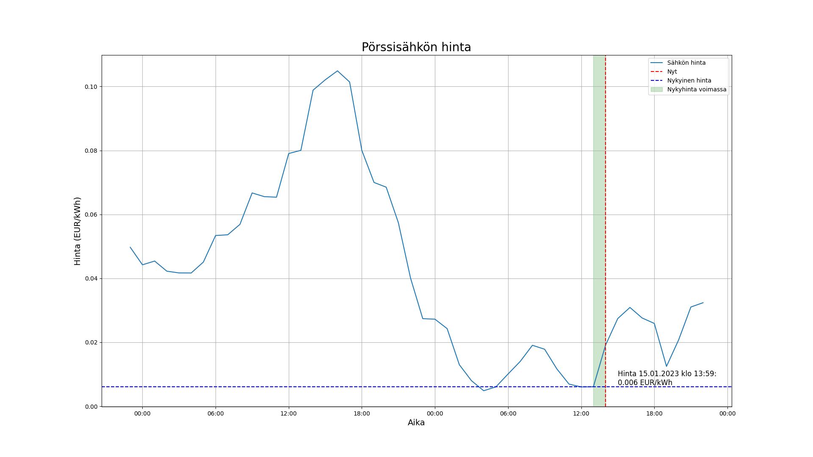
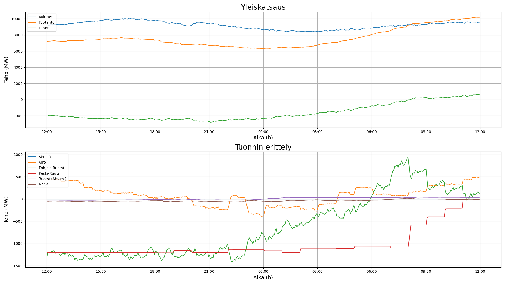

# Sähköjärjestelmän seurantatyökalu

## Tarkoitus
Työkalun avulla pystyy hakemaan Suomen sähköjärjestelmän tilatietoja sekä pörssisähkön hintatietoja.
Työkalu hakee tietonsa Fingridin ja ENTSOE:n tarjoamista rajapinnoista, ja esittää datan graafisesti käyttäjälle.
Huomioithan, että pörssisähkön hintatiedot EIVÄT tällä hetkellä sisällä arvonlisäveroa.

## Vaatimukset
Python-tulkki tulee olla asennettuna. Lisäksi seuraavat paketit vaaditaan:
- numpy
- requests
- matlplotlib

## Käyttö
Työkalu käynnistetään ajamalla `main.py` Pythonilla:
```py src\main.py [alikomennot/valitsimet]```

Aja `py src\main.py --help` saadaksesi lisätietoa alikomennoista ja valitsimista.

Alikomennot ovat `fingrid`, joka hakee Suomen sähköverkon tuotanto- ja kulutustietoja,
sekä `price`, joka hakee ENTSOE-palvelusta pörssisähkön hintatietoja.

Työkalun käyttö vaatii API-avaimen Fingridille ja/tai ENTSOE:lle.
Avaimet ovat ilmaiseksi saatavilla, mutta vaativat rekisteröitymisen palvelujen sivuille.
Oletuksena ohjelma yrittää avata tiedostoja `key_entsoe.txt` ja `key_fg.txt` avaimien lukua varten,
mutta avaimen voi myös antaa valitsimilla `--api-key` ja `--api-keyfile`.

Fingridiin voit rekisteröityä
[tästä](https://data.fingrid.fi/open-data-forms/registration/)
ja ENTSOE:een
[tästä](https://transparency.entsoe.eu/).

### Esimerkkejä:
Piirrä pörssisähkön hintatiedot interaktiiviseen ikkunaan:

```py src\main.py price plot```

Komennolla tuotettu kuva:


Piirrä sähkön tuotanto- ja kulutustiedot kuvatiedostoon `tuotanto.png` käyttäen API-avainta tiedostosta `avain.txt`:

```py src\main.py --api-keyfile avain.txt fingrid plot --save tuotanto.png```

Komennolla tuotettu kuva:
